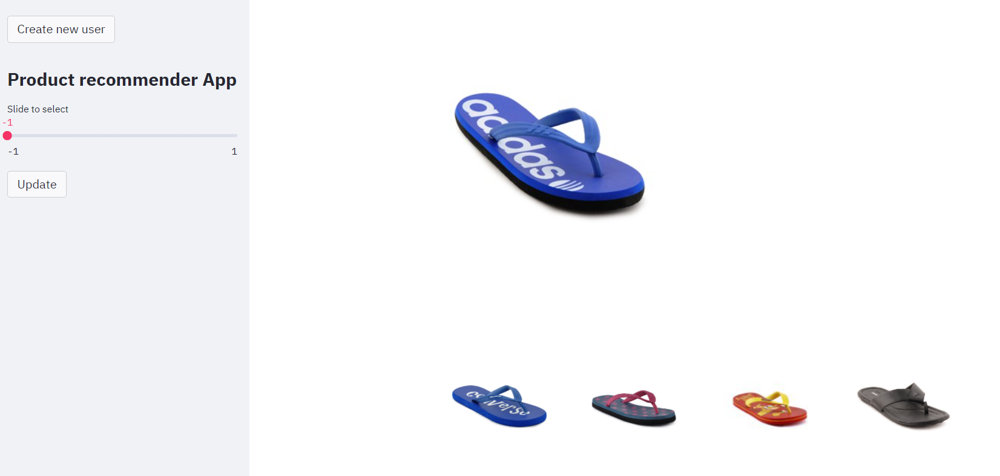
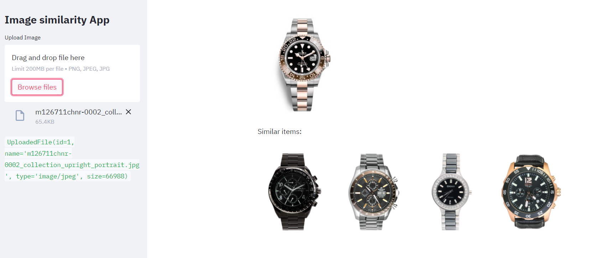

# image2vec
Building applications on top of Image Embeddings. 
Recommendation Engine, Image similarity.

1) Recommendation engine Demo <br/>


2) Image similarity Demo <br/>


This project converts product images into embeddings using the Inception V3 model pretrained with ImageNet.
Any type of images can be used, not only from products.

Once we have good embeddings, then we have accurate similarities between images. 
That's why created 2 demos: A recommendation engine, and a Image similarity search.
Both demos are created using streamlit.

#### Requirements
```bash
$ pip install -r requirements.txt
```
---
### Use
- Download any dataset of images to use

#### Change 'config.py'
- Change the 'DATABASE_PATH' variable from 'config.py' to the path of your dataset of images.
- Change the 'N_IMG' variable to the number of images you want to embed from your dataset.
- Set 'DO_KPCA' to True if you want to perform Kernel PCA dimensionality reduction on the last hidden layer from Inception V3 model.

#### Run '0_image2vec.py'
```bash
$ python 0_image2vec.py
```

#### Run '1_image_similarity.py'
```bash
$ streamlit run 1_image_similarity.py
```

#### Run '2_user_recommendation.py'
```bash
$ streamlit run 2_user_recommendation.py
```
